# Mr. Sushi — Sistema de Pedidos Multi-Sede

Sistema de pedidos y gestión de cocina para la cadena Mr. Sushi. Cada una de las 8 sedes físicas opera como un tenant independiente con su propia cola de cocina, despacho y reparto. Clientes y el programa de puntos (Neki Puntos) son compartidos entre todas las sedes.

## Integrantes del Proyecto
- Rafael Rodrigo Choque Coaquira (202410378)
- Gerald Marcelo Fernando Borjas Bernaola (202510059)
- Francis Andres Huerta Roque (20231053)

## Estructura del Repositorio

```text
todito/
├── mrsushi-backend/          Backend serverless en AWS (Lambda + DynamoDB + Step Functions + EventBridge)
├── frontend-trabajadores/    Panel web SPA para el personal (React + Vite)
├── mrsushi_clientes/         Sitio web público para clientes (HTML/CSS/JS estático)
└── api-rappi-gcp/            Simulador de integración de terceros (Google Cloud Functions + Terraform)
```

## Arquitectura del Sistema

```mermaid
flowchart TD
    %% Estilos de Elementos
    classDef aws_apigw fill:#FFF,stroke:#FF9900,stroke-width:2px,color:#232F3E;
    classDef aws_lambda fill:#FFF,stroke:#FF9900,stroke-width:2px,color:#232F3E,stroke-dasharray: 5 5;
    classDef aws_ddb fill:#FFF,stroke:#3B48CC,stroke-width:2px,color:#232F3E;
    classDef aws_sfn fill:#F0F8FF,stroke:#00A4A6,stroke-width:2.5px,color:#232F3E;
    classDef aws_eb fill:#FFF0F5,stroke:#FF4F8B,stroke-width:3px,color:#232F3E;
    classDef aws_s3 fill:#FFF,stroke:#4CAF50,stroke-width:2px,color:#232F3E;
    classDef aws_amplify fill:#FFF,stroke:#E7157B,stroke-width:2.5px,color:#232F3E;
    classDef gcp_cf fill:#FFF,stroke:#4285F4,stroke-width:2.5px,color:#232F3E;

    %% FRONTENDS
    subgraph Frontends [🌐 FRONTENDS - AWS Amplify]
        direction LR
        F1("<b>💻 mr-sushi-clientes (Amplify ZIP)</b><br/>• Stack: HTML5 / CSS3 / Vanilla JS<br/>• Flujo: Consulta menú y envía pedidos."):::aws_amplify
        F2("<b>💻 mr-sushi-trabajadores (Amplify ZIP)</b><br/>• Stack: React / Vite / Tailwind CSS<br/>• Flujo: Dashboard interno, login, avance de estados."):::aws_amplify
    end

    %% MICROSERVICIOS BACKEND AWS
    subgraph AWS_Backend [☁️ AWS CLOUD - Microservicios Serverless Node.js 18.x]
        direction TB

        %% MS-AUTENTICACION
        subgraph ms_auth [🔒 ms-autenticacion]
            direction TB
            AGW_auth["🌐 API Gateway (REST)<br/>• POST /auth/register<br/>• POST /auth/login<br/>• GET /auth/me<br/>• GET /auth/workers"]:::aws_apigw
            
            subgraph Lambdas_Auth [⚙️ Lambdas ms-autenticacion]
                L_reg("⚙️ registrar"):::aws_lambda
                L_log("⚙️ login"):::aws_lambda
                L_perf("⚙️ perfil"):::aws_lambda
                L_trab("⚙️ trabajadores"):::aws_lambda
            end

            DDB_auth[("🗄️ DynamoDB<br/>• MrSushiUsuarios<br/>• MrSushiUsuarioEmailLocks")]:::aws_ddb
            
            AGW_auth --> L_reg & L_log & L_perf & L_trab
            L_reg & L_log & L_perf & L_trab --> DDB_auth
        end

        %% MS-PEDIDOS
        subgraph ms_pedidos [📦 ms-pedidos]
            direction TB
            AGW_ped["🌐 API Gateway (REST)<br/>• POST /pedidos<br/>• GET /pedidos<br/>• GET /pedidos/{pedidoId}"]:::aws_apigw
            
            subgraph Lambdas_Ped [⚙️ Lambdas ms-pedidos]
                L_cped("⚙️ crearPedido"):::aws_lambda
                L_oped("⚙️ obtenerPedido"):::aws_lambda
                L_lped("⚙️ listarPedidos"):::aws_lambda
            end

            DDB_ped[("🗄️ DynamoDB<br/>• MrSushiPedidos<br/>• MrSushiContadores")]:::aws_ddb
            
            AGW_ped --> L_cped & L_oped & L_lped
            L_cped & L_oped & L_lped --> DDB_ped
        end

        %% MS-CLIENTES
        subgraph ms_clientes [👤 ms-clientes]
            direction TB
            AGW_cli["🌐 API Gateway (REST)<br/>• POST /clientes/register<br/>• POST /clientes/login<br/>• GET/PATCH /clientes/me<br/>• GET/POST /clientes/me/direcciones<br/>• GET /clientes/me/neki-puntos<br/>• PATCH /clientes/{clienteId}/neki-puntos"]:::aws_apigw
            
            subgraph Lambdas_Cli [⚙️ Lambdas ms-clientes]
                L_rcli("⚙️ registrarCliente"):::aws_lambda
                L_lcli("⚙️ loginCliente"):::aws_lambda
                L_ocli("⚙️ obtenerPerfil"):::aws_lambda
                L_acli("⚙️ actualizarPerfil"):::aws_lambda
                L_adcl("⚙️ agregarDireccion"):::aws_lambda
                L_ldcl("⚙️ listarDirecciones"):::aws_lambda
                L_opun("⚙️ obtenerPuntos"):::aws_lambda
                L_apun("⚙️ ajustarPuntos"):::aws_lambda
            end

            DDB_cli[("🗄️ DynamoDB<br/>• MrSushiClientes<br/>• MrSushiClienteEmailLocks")]:::aws_ddb

            AGW_cli --> L_rcli & L_lcli & L_ocli & L_acli & L_adcl & L_ldcl & L_opun & L_apun
            L_rcli & L_lcli & L_ocli & L_acli & L_adcl & L_ldcl & L_opun & L_apun --> DDB_cli
        end

        %% MS-SEDES
        subgraph ms_sedes [🏢 ms-sedes]
            direction TB
            AGW_sed["🌐 API Gateway (REST)<br/>• GET /sedes"]:::aws_apigw
            L_sedes("⚙️ listarSedes"):::aws_lambda
            DDB_sedes[("🗄️ DynamoDB<br/>• MrSushiSedes")]:::aws_ddb
            
            AGW_sed --> L_sedes --> DDB_sedes
        end

        %% MS-FLUJO-TRABAJO
        subgraph ms_flujo [🔄 ms-flujo-trabajo]
            direction TB
            AGW_flujo["🌐 API Gateway (REST)<br/>• POST /flujo-trabajo/completar<br/>• GET /flujo-trabajo/{pedidoId}"]:::aws_apigw
            
            subgraph Lambdas_Flujo [⚙️ Lambdas ms-flujo-trabajo]
                L_comp("⚙️ completarEtapa"):::aws_lambda
                L_save("⚙️ guardarTaskToken"):::aws_lambda
                L_ofluj("⚙️ obtenerFlujo"):::aws_lambda
            end

            DDB_flujo[("🗄️ DynamoDB<br/>• MrSushiFlujoTrabajo")]:::aws_ddb

            AGW_flujo --> L_comp & L_ofluj
            L_save --> DDB_flujo
            L_comp & L_ofluj --> DDB_flujo
        end

        %% EVENTBRIDGE
        subgraph EB_Bus [🚌 INTEGRACIÓN ASÍNCRONA - EventBridge]
            EB_Custom{{"🚌 Bus de Eventos Personalizado:<br/><b>mrsushi-bus</b>"}}:::aws_eb
        end

        %% WORKFLOW STEP FUNCTIONS
        subgraph SFN_Orquestador [🔄 WORKFLOW ORQUESTADO - Step Functions]
            SFN_State(("🔄 Máquina de Estados<br/>(mrsushi-pedido-flow)")):::aws_sfn
            
            S_Recibido["📥 PEDIDO RECIBIDO"]:::aws_sfn
            S_Coccion["🍳 COCCIÓN (Cocinero)<br/><i>waitForTaskToken</i>"]:::aws_sfn
            S_Empacado["🥡 EMPAQUETADO (Despacho)<br/><i>waitForTaskToken</i>"]:::aws_sfn
            S_Reparto["🛵 EN REPARTO (Reparto)<br/><i>waitForTaskToken</i>"]:::aws_sfn
            S_Entregado["🏁 ENTREGADO"]:::aws_sfn

            SFN_State --> S_Recibido --> S_Coccion --> S_Empacado --> S_Reparto --> S_Entregado
        end

        %% MS-RECIBOS
        subgraph ms_recibos [📄 ms-recibos]
            direction TB
            L_recibo("⚙️ generarRecibo"):::aws_lambda
            S3_bucket[("📥 Amazon S3 Bucket<br/>mrsushi-recibos-storage-v2-2026")]:::aws_s3
            
            L_recibo --> S3_bucket
        end
    end

    %% MULTINUBE GCP
    subgraph GCP_Cloud [☁️ GOOGLE CLOUD PLATFORM - Cloud Function]
        direction TB
        GCP_CF("⚡ Cloud Function: rappiWebhook<br/>• Framework: Express.js (GCP Core)"):::gcp_cf
        GCP_R1("⚡ POST /rappi/pedidos<br/>• Simula compra externa<br/>• Inyecta 'origen: Rappi'"):::gcp_cf
        GCP_R2("⚡ POST /rappi/estado<br/>• Webhook de terceros<br/>• Recibe actualizaciones"):::gcp_cf
        
        GCP_CF --> GCP_R1 & GCP_R2
    end

    %% INTERACCIONES Y CONEXIONES DE INTEGRACIÓN
    F1 -.-> |"HTTP Requests"| AGW_ped & AGW_cli & AGW_sed
    F2 -.-> |"HTTP Requests + JWT"| AGW_auth & AGW_flujo & AGW_ped & AGW_sed

    GCP_R1 -- "Reenvía Pedido (HTTP POST)" --> AGW_ped
    L_cped -- "PutEvents (SDK)" --> EB_Custom
    EB_Custom -- "Dispara inicio" --> SFN_State

    %% Callback logic
    S_Coccion & S_Empacado & S_Reparto -.-> |"1. Invoca y envía Token"| L_save
    L_comp -- "2. SendTaskSuccess (SDK)" --> SFN_State
    L_comp -- "3. Notifica Estado (HTTP POST)" --> GCP_R2

    S_Entregado -- "Emite: PedidoCompletado" --> EB_Custom
    EB_Custom -- "Regla EventBridge" --> L_recibo
```



### Backend: 7 microservicios independientes (`mrsushi-backend/`)

Cada carpeta `ms-*` representa un servicio en Serverless Framework, con su respectivo archivo `serverless.yml`, tablas asociadas en Amazon DynamoDB y funciones Lambda en ejecución.

| Servicio | Responsabilidad | Endpoints / Disparadores |
|---|---|---|
| `ms-sedes` | Registro de las 8 sedes físicas (coordenadas geográficas y radio de cobertura). | `GET /sedes` |
| `ms-autenticacion` | Control de credenciales de trabajadores. Permite registrar trabajadores atados a una sede específica. | `POST /auth/register`, `POST /auth/login`, `GET /auth/me`, `GET /auth/workers` |
| `ms-clientes` | Cuentas globales de clientes. Maneja perfil, direcciones de entrega y saldo en el programa Neki Puntos. | `POST /clientes/register`, `POST /clientes/login`, `GET /clientes/me`, `PATCH /clientes/me`, `POST/GET /clientes/me/direcciones`, `GET /clientes/me/neki-puntos`, `PATCH /clientes/{clienteId}/neki-puntos` |
| `ms-pedidos` | Recepción, validación espacial de la sede de destino y creación de pedidos. Emite evento inicial a EventBridge. | `POST /pedidos`, `GET /pedidos/{pedidoId}`, `GET /pedidos` |
| `ms-flujo-trabajo` | Centraliza el avance de las etapas del pedido y reanuda el orquestador. | `POST /flujo-trabajo/completar`, `GET /flujo-trabajo/{pedidoId}` |
| `ms-stepfunctions` | Orquesta de manera reactiva el flujo del pedido por medio de Step Functions. | (Orquestado internamente sin API REST propia) |
| `ms-recibos` | Escucha la finalización de los pedidos en EventBridge y genera de forma asíncrona recibos inmutables en S3. | (Disparador: Regla de EventBridge ante `PedidoCompletado`) |

### Flujo del Pedido (AWS Step Functions)

```text
RECIBIDO
   │
   ▼
COCCIÓN (Cocinero) ◄────────── Espera mediante Task Token
   │
   ▼
EMPAQUETADO (Despachador) ◄─── Espera mediante Task Token
   │
   ├── si es "para llevar" ──► LISTO PARA RECOGER ──► ENTREGADO
   │
   └── si es delivery ────────► EN REPARTO (Repartidor) ──► ENTREGADO
```

Cada etapa del flujo de trabajo utiliza la integración optimizada `waitForTaskToken`. La ejecución se pausa y se reanuda únicamente cuando el trabajador autorizado presiona "Completar" en el panel frontend de la sede.

### Modelo de Datos (DynamoDB)

Todas las tablas están diseñadas con claves descriptivas para facilitar la lectura directa de los registros sin recurrir a estructuras genéricas PK/SK.

| Tabla | Partition Key | Sort Key | Índices Secundarios (GSI) |
|---|---|---|---|
| `MrSushiSedes` | `sedeId` | — | — |
| `MrSushiUsuarios` | `sedeId` | `email` | — |
| `MrSushiUsuarioEmailLocks` | `email` | — | — |
| `MrSushiClientes` | `clienteId` | `itemType` (`PERFIL` / `DIRECCION#{id}`) | — |
| `MrSushiClienteEmailLocks` | `email` | — | — |
| `MrSushiPedidos` | `sedeId` | `pedidoId` | `ClienteIndex` (clienteId+createdAt), `SedeCreatedIndex` (sedeId+createdAt) |
| `MrSushiContadores` | `sedeId` | `fecha` | — |
| `MrSushiFlujoTrabajo` | `pedidoId` | `step` | — |

### Aislamiento entre Sedes

- **Validación del lado del servidor:** Los trabajadores solo pueden ver y operar los pedidos asociados a su sede. El valor `sedeId` se extrae de manera segura del token JWT en el backend, evitando manipulaciones externas en el frontend.
- **Geolocalización Automática:** Cuando un pedido entra por delivery, el backend (`ms-pedidos`) calcula la sede activa más cercana al cliente utilizando su ubicación. Si la distancia excede el radio de cobertura (`coverageRadius`) de todas las sedes, el pedido se cancela automáticamente.
- **Locks de Correo:** Para login, las tablas de "locks" por email resuelven de forma unívoca a qué sede o cuenta de cliente pertenece el usuario de manera previa a la verificación criptográfica de la clave.

## Frontends

### 1. Panel de Personal (`frontend-trabajadores/`)
Aplicación SPA en **React 19 + Vite** desplegada de manera manual en AWS Amplify. Muestra en tiempo real las colas de pedidos segmentadas por el rol del trabajador autenticado (Cocinero, Despacho, Repartidor), con dashboards gráficos de métricas operacionales para administradores.

Variables de entorno configuradas:
```text
VITE_AUTH_API_URL=...      # ms-autenticacion
VITE_PEDIDOS_API_URL=...   # ms-pedidos
VITE_FLUJO_API_URL=...     # ms-flujo-trabajo
VITE_SEDES_API_URL=...     # ms-sedes
```

### 2. Portal de Clientes (`mrsushi_clientes/`)
Sitio web estático en **HTML5/CSS3/Vanilla JS** sin proceso de compilación, desplegado en AWS Amplify. Permite realizar pedidos, registrar direcciones con geolocalización de coordenadas en un mapa interactivo y acumular Neki Puntos.

Configuración en `src/js/api-config.js` (variables globales `window.MR_SUSHI_*`).

## Despliegue de Infraestructura

### Despliegue de Backend (AWS)
Requiere tener configuradas las credenciales de AWS CLI y Serverless Framework instalado de manera global.
```bash
cd mrsushi-backend
npm run install:all
npm run deploy:all         # Despliega los 7 microservicios en orden correlativo
node ms-sedes/seed.js      # Siembra inicial de las 8 sedes físicas (ejecutar una vez)
```

### Despliegue de Webhook (GCP)
Requiere tener inicializado Terraform y gcloud CLI configurado en el proyecto.
```bash
cd api-rappi-gcp
terraform init
terraform apply -auto-approve
```

### Empaquetado Manual para AWS Amplify (Frontends)
Ambos frontends se compilan y empaquetan en archivos `.zip` antes de subirse manualmente a la consola de AWS Amplify (Hosting → "Deploy without Git"):
```bash
# 1. Empaquetado de panel de trabajadores (React)
cd frontend-trabajadores && npm install && npm run build
cd dist && zip -r ../mrsushi-trabajadores-amplify.zip . -x ".*"

# 2. Empaquetado de sitio de clientes (HTML estático)
cd mrsushi_clientes && zip -r mrsushi-clientes-amplify.zip . -x ".git/*" -x "*.zip"
```
