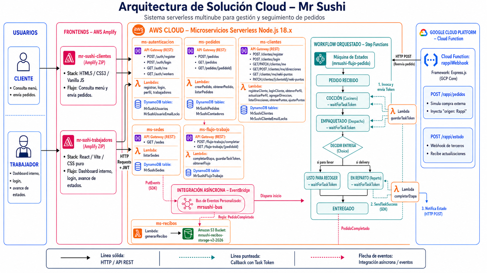

<div align="center">

  

  # 🍣 Mr Sushi Cloud Architecture

  **Sistema serverless multinube para gestión y seguimiento de pedidos**

  [](https://aws.amazon.com/)
  [](https://www.serverless.com/)
  [](https://nodejs.org/)
  [](https://aws.amazon.com/dynamodb/)
  [](https://aws.amazon.com/eventbridge/)
  [](https://aws.amazon.com/step-functions/)
  [](https://cloud.google.com/functions)
  [](#-licencia)

  [Arquitectura](#-arquitectura-general) · [Instalación](#-instalación-y-ejecución) · [API](#-endpoints-principales) · [Despliegue](#-despliegue)

</div>

---

## 📌 Presentación del proyecto

**Mr Sushi Cloud Architecture** es el backend serverless que soporta la operación de pedidos de la cadena de restaurantes Mr Sushi. El sistema administra el ciclo de vida completo de un pedido —desde su creación hasta la entrega— a través de microservicios independientes desplegados en AWS, coordinados mediante eventos y máquinas de estado.

El proyecto integra, además, una nube secundaria (Google Cloud Platform) para simular la llegada de pedidos desde un agregador externo tipo Rappi, demostrando un escenario real de arquitectura **multinube**.

## 🎯 Problema que resuelve

Una cadena de restaurantes con múltiples sedes físicas necesita:

- Coordinar pedidos de distintos orígenes (clientes propios y aplicaciones de delivery externas) sin acoplar la lógica de negocio a un solo canal.
- Dar seguimiento en tiempo real a las etapas de un pedido (cocina, empaquetado, reparto) sin depender de servidores siempre encendidos.
- Aislar la información de cada sede evitando que un trabajador vea u opere pedidos de otra sede.
- Escalar automáticamente durante picos de demanda sin gestionar infraestructura manualmente.

## 🚀 Objetivo del sistema

Ofrecer una plataforma **100% serverless y event-driven** que:

- Reduzca costos operativos al pagar solo por invocación (Lambda) y por lectura/escritura (DynamoDB).
- Desacople los microservicios mediante eventos (EventBridge) en lugar de llamadas síncronas directas.
- Orqueste el flujo de un pedido de forma visual y auditable con Step Functions.
- Permita integrar canales externos (Rappi) sin modificar el núcleo del backend.

## 🏗 Arquitectura general

<div align="center">
  
</div>

El sistema combina servicios administrados de AWS con una función externa en Google Cloud:

| Servicio | Rol dentro de la arquitectura |
|---|---|
| **AWS Amplify** | Aloja y publica los dos frontends (clientes y trabajadores). |
| **API Gateway** | Expone los endpoints HTTP de cada microservicio. |
| **AWS Lambda** | Ejecuta la lógica de negocio de cada microservicio (Node.js 18.x). |
| **DynamoDB** | Almacena usuarios, clientes, pedidos, sedes y flujo de trabajo. |
| **EventBridge** | Bus de eventos que desacopla la creación de pedidos de su orquestación. |
| **Step Functions** | Orquesta las etapas del pedido usando `waitForTaskToken`. |
| **S3** | Almacena los recibos generados al finalizar cada pedido. |
| **Google Cloud Function** | Simula la integración externa con Rappi (`rappiWebhook`). |

## 🛠 Tecnologías utilizadas

| Categoría | Tecnologías |
|---|---|
| **Frontend** | HTML5, CSS3, JavaScript (sitio de clientes) · React 19 + Vite (panel de trabajadores) |
| **Backend** | Node.js 18.x, AWS Lambda, Serverless Framework, JWT (`jsonwebtoken`), `bcryptjs` |
| **Base de datos** | Amazon DynamoDB (tablas `PAY_PER_REQUEST` con índices GSI) |
| **Orquestación** | AWS Step Functions (`serverless-step-functions`) |
| **Eventos** | Amazon EventBridge (bus personalizado `mrsushi-bus`) |
| **Almacenamiento** | Amazon S3 |
| **Multinube** | Google Cloud Functions + Terraform (proveedores `google`, `archive`) |
| **Despliegue** | AWS Amplify (Hosting manual), Serverless Framework CLI, Terraform + gcloud |

## 🧩 Microservicios principales

| Microservicio | Responsabilidad | Servicios AWS/GCP usados | Datos principales |
|---|---|---|---|
| `ms-autenticacion` | Registro y login de trabajadores, emisión de JWT y consulta de perfil. | API Gateway, Lambda, DynamoDB | `MrSushiUsuarios`, `MrSushiUsuarioEmailLocks` |
| `ms-pedidos` | Creación, consulta y listado de pedidos. Publica el evento inicial del flujo. | API Gateway, Lambda, DynamoDB, EventBridge | `MrSushiPedidos`, `MrSushiContadores` |
| `ms-clientes` | Cuentas de clientes, direcciones de entrega y programa de puntos (Neki Puntos). | API Gateway, Lambda, DynamoDB | `MrSushiClientes`, `MrSushiClienteEmailLocks` |
| `ms-sedes` | Registro de sedes físicas (coordenadas y radio de cobertura). | API Gateway, Lambda, DynamoDB | `MrSushiSedes` |
| `ms-flujo-trabajo` | Avance de etapas del pedido y reanudación de Step Functions vía Task Token. | API Gateway, Lambda, DynamoDB, Step Functions (SDK) | `MrSushiFlujoTrabajo` |
| `ms-recibos` | Genera el recibo final del pedido al recibir el evento `PedidoCompletado`. | Lambda, EventBridge, S3 | Archivos `.txt` en `mrsushi-recibos-storage-v2-2026` |
| `ms-stepfunctions` | Define la máquina de estados que orquesta el flujo completo del pedido. | Step Functions, EventBridge | Estado interno de ejecución (sin tabla propia) |
| Cloud Function `rappiWebhook` | Simula un agregador externo (Rappi) que envía pedidos y recibe actualizaciones de estado. | Google Cloud Functions, Terraform | N/A (reenvía HTTP hacia `ms-pedidos`) |

## 🔄 Flujo del pedido

1. El cliente crea un pedido desde la aplicación web.
2. El pedido entra por **API Gateway**.
3. La Lambda `crearPedido` (`ms-pedidos`) valida y registra el pedido.
4. El pedido se guarda en **DynamoDB** (`MrSushiPedidos`).
5. Se publica un evento `PedidoCreado` en **EventBridge** (`mrsushi-bus`).
6. Una regla de EventBridge inicia la máquina de estados **Step Functions** (`mrsushi-flujo-pedido`).
7. Step Functions orquesta las etapas del pedido:
   - 📥 Pedido recibido
   - 🍳 Cocción
   - 🥡 Empaquetado
   - 🛵 En reparto (o listo para recoger, si aplica)
   - 🏁 Entregado
8. Los trabajadores completan cada etapa desde el dashboard interno (`mrsushi-frontend-trabajadores`).
9. `ms-flujo-trabajo` responde a Step Functions usando `SendTaskSuccess`, reanudando la ejecución pausada.
10. Al finalizar el pedido, se emite el evento `PedidoCompletado`, `ms-recibos` genera un recibo y lo almacena en **S3**.
11. Si el pedido viene desde Rappi, la Cloud Function de GCP reenvía el pedido al backend (AWS) y recibe actualizaciones de estado vía webhook.

## 🌐 Integración multinube con GCP/Rappi

La Cloud Function `rappiWebhook` (Node.js/Express, desplegada con Terraform en GCP) simula la relación con un agregador de delivery externo:

| Ruta | Dirección | Descripción |
|---|---|---|
| `POST /rappi/pedidos` | GCP → AWS | Simula una compra hecha desde la app de Rappi; agrega `origen: "Rappi"` y reenvía el pedido al endpoint `POST /pedidos` de `ms-pedidos`. |
| `POST /rappi/estado` | AWS → GCP | Webhook que recibe actualizaciones de estado del pedido enviadas por `ms-flujo-trabajo`. |

Este diseño demuestra cómo un sistema puede recibir pedidos de canales externos sin modificar su lógica interna, tratando a Rappi como un cliente más de la API de `ms-pedidos`.

## 📂 Estructura del repositorio

```text
mr-sushi/
├── api-rappi-gcp/                  Cloud Function (GCP) que simula la integración con Rappi
│   ├── index.js
│   ├── server.js
│   ├── main.tf                     Infraestructura como código (Terraform)
│   └── package.json
├── docs/
│   └── informe.typ                 Informe técnico del proyecto (Typst)
├── mrsushi-backend/                Backend serverless en AWS
│   ├── ms-autenticacion/
│   ├── ms-clientes/
│   ├── ms-flujo-trabajo/
│   ├── ms-pedidos/
│   ├── ms-recibos/
│   ├── ms-sedes/
│   ├── ms-stepfunctions/
│   └── package.json                 Scripts de instalación y despliegue conjunto
├── mrsushi-frontend-clientes/       Sitio web estático para clientes (HTML/CSS/JS)
│   ├── src/
│   ├── images/
│   └── *.html
├── mrsushi-frontend-trabajadores/   Panel interno para trabajadores (React + Vite)
│   ├── src/
│   └── package.json
├── arqui.png                        Diagrama de arquitectura del sistema
├── Rappi_Simulator.postman_collection.json
└── README.md
```

## ⚙️ Instalación y ejecución

### Backend (AWS)

```bash
cd mrsushi-backend
npm run install:all
```

### Panel de trabajadores (React + Vite)

```bash
cd mrsushi-frontend-trabajadores
npm install
npm run dev       # entorno de desarrollo
npm run build     # build de producción
npm run preview   # previsualizar build
```

### Sitio de clientes

Sitio estático sin proceso de build. Basta con abrir `mrsushi-frontend-clientes/index.html` o servirlo con cualquier servidor estático. La configuración de endpoints se define en [`src/js/api-config.js`](mrsushi-frontend-clientes/src/js/api-config.js).

### Cloud Function (GCP)

```bash
cd api-rappi-gcp
npm install
node server.js   # levanta el simulador en local (puerto 3000) usando server.js
```

## 🔐 Variables de entorno

| Variable | Descripción | Obligatoria | Ejemplo |
|---|---|---|---|
| `JWT_SECRET` | Secreto usado para firmar tokens JWT en `ms-autenticacion` y `ms-clientes`. | No (tiene valor por defecto en `serverless.yml`) | `mi-secreto-super-seguro` |
| `VITE_AUTH_API_URL` | URL base del API Gateway de `ms-autenticacion` (frontend trabajadores). | Sí | `https://xxxxxxxxxx.execute-api.us-east-1.amazonaws.com` |
| `VITE_PEDIDOS_API_URL` | URL base del API Gateway de `ms-pedidos` (frontend trabajadores). | Sí | `https://xxxxxxxxxx.execute-api.us-east-1.amazonaws.com` |
| `VITE_FLUJO_API_URL` | URL base del API Gateway de `ms-flujo-trabajo` (frontend trabajadores). | Sí | `https://xxxxxxxxxx.execute-api.us-east-1.amazonaws.com` |
| `VITE_SEDES_API_URL` | URL base del API Gateway de `ms-sedes` (frontend trabajadores). | Sí | `https://xxxxxxxxxx.execute-api.us-east-1.amazonaws.com` |
| `MR_SUSHI_CLIENTES_API_URL` | URL base del API Gateway de `ms-clientes` (frontend clientes, definida en `window`). | Sí | `https://xxxxxxxxxx.execute-api.us-east-1.amazonaws.com` |
| `MR_SUSHI_PEDIDOS_API_URL` | URL base del API Gateway de `ms-pedidos` (frontend clientes, definida en `window`). | Sí | `https://xxxxxxxxxx.execute-api.us-east-1.amazonaws.com` |

> Los valores reales de ejemplo se encuentran documentados en [`mrsushi-frontend-trabajadores/.env.example`](mrsushi-frontend-trabajadores/.env.example) y en [`mrsushi-frontend-clientes/src/js/api-config.js`](mrsushi-frontend-clientes/src/js/api-config.js). No se muestran URLs de producción reales en esta tabla.

## 🔌 Endpoints principales

| Método | Endpoint | Microservicio | Descripción |
|---|---|---|---|
| `POST` | `/auth/register` | `ms-autenticacion` | Registra un trabajador asociado a una sede. |
| `POST` | `/auth/login` | `ms-autenticacion` | Inicia sesión y emite un JWT. |
| `GET` | `/auth/me` | `ms-autenticacion` | Devuelve el perfil del trabajador autenticado. |
| `GET` | `/auth/workers` | `ms-autenticacion` | Lista los trabajadores registrados. |
| `POST` | `/pedidos` | `ms-pedidos` | Crea un nuevo pedido y publica el evento `PedidoCreado`. |
| `GET` | `/pedidos` | `ms-pedidos` | Lista pedidos. |
| `GET` | `/pedidos/{pedidoId}` | `ms-pedidos` | Consulta el detalle de un pedido. |
| `POST` | `/clientes/register` | `ms-clientes` | Registra una cuenta de cliente. |
| `POST` | `/clientes/login` | `ms-clientes` | Inicia sesión de cliente. |
| `GET` | `/clientes/me` | `ms-clientes` | Consulta el perfil del cliente. |
| `PATCH` | `/clientes/me` | `ms-clientes` | Actualiza el perfil del cliente. |
| `POST` | `/clientes/me/direcciones` | `ms-clientes` | Agrega una dirección de entrega. |
| `GET` | `/clientes/me/direcciones` | `ms-clientes` | Lista direcciones del cliente. |
| `GET` | `/clientes/me/neki-puntos` | `ms-clientes` | Consulta el saldo de puntos. |
| `PATCH` | `/clientes/{clienteId}/neki-puntos` | `ms-clientes` | Ajusta el saldo de puntos de un cliente. |
| `GET` | `/sedes` | `ms-sedes` | Lista las sedes físicas registradas. |
| `POST` | `/flujo-trabajo/completar` | `ms-flujo-trabajo` | Marca como completada la etapa actual del pedido. |
| `GET` | `/flujo-trabajo/{pedidoId}` | `ms-flujo-trabajo` | Consulta el estado del flujo de un pedido. |
| `POST` | `/rappi/pedidos` | Cloud Function `rappiWebhook` | Simula una compra desde Rappi y la reenvía a `ms-pedidos`. |
| `POST` | `/rappi/estado` | Cloud Function `rappiWebhook` | Recibe actualizaciones de estado del pedido. |

## 📦 Despliegue

### ☁️ AWS (nube principal)

**Backend** — cada `ms-*` es un servicio independiente de Serverless Framework. `deploy:all` despliega los 7 microservicios en orden correlativo (`sedes → auth → clientes → flujo → stepfunctions → pedidos`), ya que `ms-stepfunctions` referencia por ARN una Lambda de `ms-flujo-trabajo`:

```bash
cd mrsushi-backend
npm run install:all
npm run deploy:all
node ms-sedes/seed.js   # siembra inicial de las 8 sedes (una sola vez)
```

Como parte de ese despliegue se crean automáticamente:
- **Tablas DynamoDB** (stack de CloudFormation de cada `serverless.yml`).
- **Máquina de estados** de Step Functions (`ms-stepfunctions`, vía plugin `serverless-step-functions`).
- **Bus de eventos** `mrsushi-bus` y sus reglas (`ms-stepfunctions` y `ms-recibos`).

**Frontends** — no usan CI/CD conectado a Git; se empaquetan manualmente en `.zip` y se suben por consola a **AWS Amplify** (Hosting → "Deploy without Git"), una app de Amplify por frontend:

```bash
# Panel de trabajadores (requiere build)
cd mrsushi-frontend-trabajadores && npm install && npm run build
cd dist && zip -r ../mrsushi-trabajadores-amplify.zip . -x ".*"

# Sitio de clientes (estático, sin build)
cd mrsushi-frontend-clientes && zip -r mrsushi-clientes-amplify.zip . -x ".git/*" -x "*.zip"
```

### 🌐 Google Cloud (nube secundaria — simulador de Rappi)

La Cloud Function `rappiWebhook` se despliega con **Terraform** (no Serverless Framework). `main.tf` habilita las APIs necesarias (`cloudfunctions`, `cloudbuild`, `artifactregistry`), empaqueta `index.js` + `package.json` en un `.zip`, lo sube a un bucket de Cloud Storage y crea la función pública `rappi-simulator` (runtime `nodejs20`, trigger HTTP, invocable por `allUsers`):

```bash
cd api-rappi-gcp
terraform init
terraform apply -auto-approve
```

### Diferencias entre ambos despliegues

| | AWS | GCP |
|---|---|---|
| Herramienta | Serverless Framework | Terraform |
| Unidad de despliegue | 7 stacks independientes (uno por microservicio) | 1 función |
| Frontends | Sí (Amplify, manual) | No aplica |
| Rol de la nube | Núcleo del sistema (todo el negocio) | Simula un cliente externo (Rappi) que llama a la API de AWS |

## 📊 Estado actual del proyecto

- ✅ 7 microservicios AWS operativos (`ms-autenticacion`, `ms-clientes`, `ms-sedes`, `ms-pedidos`, `ms-flujo-trabajo`, `ms-stepfunctions`, `ms-recibos`).
- ✅ Flujo de pedido orquestado end-to-end con Step Functions y Task Tokens.
- ✅ Integración multinube funcional con Google Cloud Function (`rappiWebhook`).
- ✅ Dos frontends desplegados en AWS Amplify (clientes y trabajadores).
- ⚠️ Sin suite de pruebas automatizada: el backend solo cuenta con verificación de sintaxis (`npm run check:syntax`).

## 📄 Licencia

Distribuido bajo licencia **ISC**, según lo declarado en los `package.json` del backend (`mrsushi-backend`, `ms-recibos`, `ms-stepfunctions`).

---

## 🎓 Uso para presentación

Resumen copiable para diapositivas:

- **Idea principal**: sistema serverless multinube para la gestión de pedidos de la cadena Mr Sushi.
- **Problema**: coordinar pedidos de múltiples canales y sedes sin infraestructura fija ni acoplamiento entre servicios.
- **Solución propuesta**: microservicios independientes en AWS (Lambda + API Gateway + DynamoDB) coordinados por eventos (EventBridge) y orquestados por una máquina de estados (Step Functions).
- **Arquitectura**: AWS Amplify (frontends) + API Gateway + Lambda + DynamoDB + EventBridge + Step Functions + S3, integrados con una Cloud Function en Google Cloud.
- **Flujo del pedido**: creación → validación → registro en DynamoDB → evento en EventBridge → orquestación en Step Functions (cocción, empaquetado, reparto) → entrega → recibo en S3.
- **Integración multinube**: Google Cloud Function `rappiWebhook` simula un agregador externo, reenviando pedidos hacia AWS y recibiendo actualizaciones de estado.
- **Beneficios**: costo por uso, escalabilidad automática, bajo acoplamiento entre servicios y trazabilidad completa del ciclo de vida del pedido.

<div align="center">

Desarrollado por Rafael Choque Coaquira, Gerald Borjas Bernaola y Francis Huerta Roque

</div>
